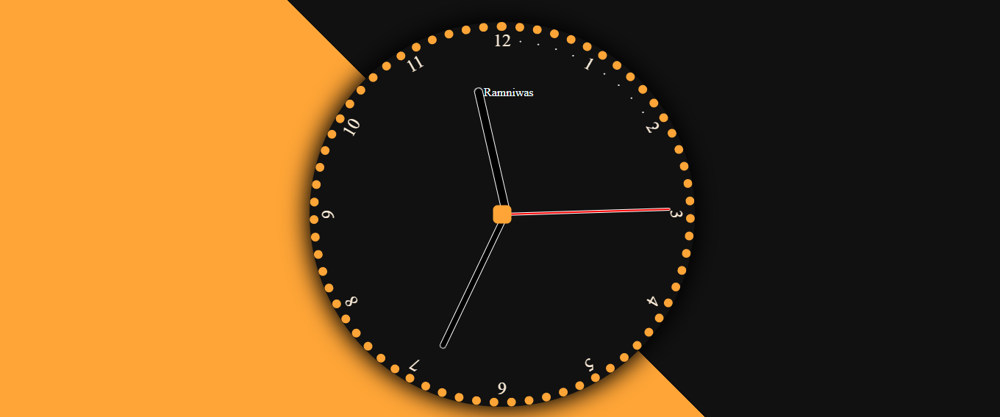

> This is a JavaScript practice with [JavaScript30](https://javascript30.com/) by [Wes Bos](https://github.com/wesbos) without any frameworks, no compilers, no boilerplate, and no libraries.

# 02 - JS + CSS Clock
pointers rotate animation, get times, changing pointer positions.

### Initialize pointer positions and rotation along the x-axis

`transform-origin: 100%; // transform-origin: right;`

`transition-timing-function: cubic-bezier();`

- `transform-origin` moves the origin of rotation along x-axis. check it [here](https://developer.mozilla.org/en-US/docs/Web/CSS/transform-origin).

- `transition-timing-function` here is for the real clock **tic-tock**-like effect.

### Get time

`setInterval(setDate, 1000);`

- the `setInterval` function runs a function passed to it every interval specified which to implement the second pointer's rotating effect.

- create `Date()` to get `now.getSeconds()`, `now.getMinutes()` and `now.getHours()`.

- culculating angles of second, minute, hour.

`const secondsDegrees = ((seconds / 60) * 360) ;`
`const minsDegrees = ((secondsDegrees / 360 + mins) / 60) * 360;`
`const hourDegrees = ((minsDegrees / 360 + hour) / 12) * 360;`