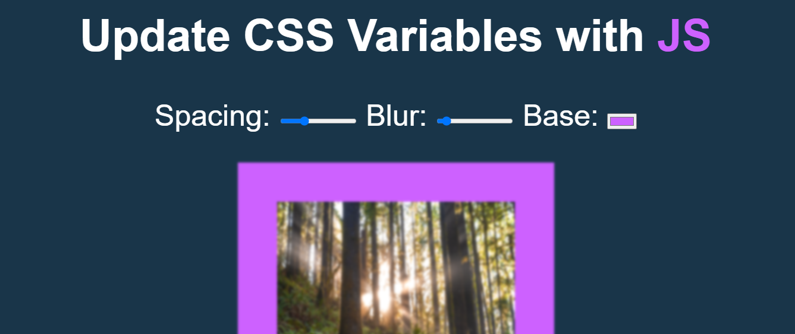
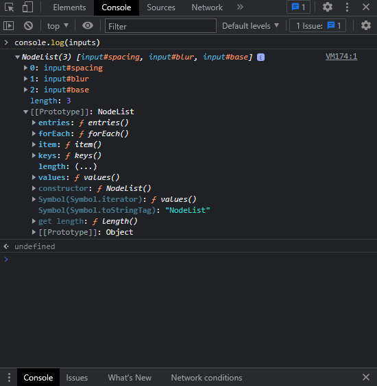
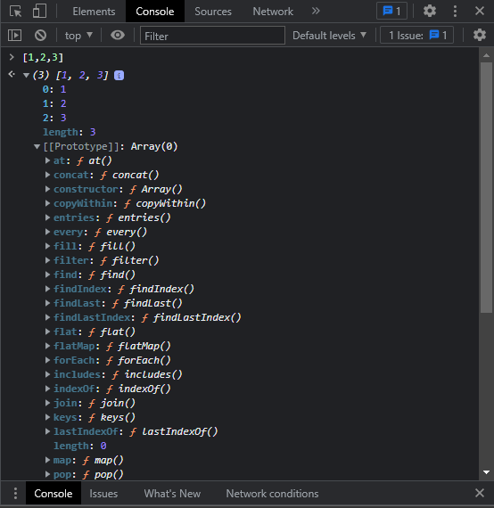

> This is a JavaScript practice with [JavaScript30](https://javascript30.com/) by [Wes Bos](https://github.com/wesbos) without any frameworks, no compilers, no boilerplate, and no libraries.

# 03 - CSS Variables and JS


`:root`, CSS Variables definition `var(--xxx)`, `filter: blur()`, `change` event and `mousemove` event

- `:root` selector matches the document's root element is always the html element and it's also where we declare the variable for the base element in HTML.
- To create a variable with global scope, declare it inside the `:root` selector.
- The `:root` selector matches the document's root element.

- once we declare CSS Variables, then we can add it to our specific elements, like `img` below, check how to declare it [here](https://developer.mozilla.org/en-US/docs/Web/CSS/Using_CSS_variables).

- CSS Variable declare syntax is `--`, just like `$` in SASS.

```
:root {
  --spacing: 10px;
}

img {
  padding: var(--spacing);
}
```
- CSS `filter` provides such as `blur`, `bightness` and so on, take a look at it [here](https://developer.mozilla.org/en-US/docs/Web/CSS/filter).

- NodeList v.s. Array : NodeList is **NOT** an Array.See the below images of Nodelist and Array which containing prototypes.
   

- how to call inputs through js in basic way:-
```
console.log(inputs.item(0));
console.log(inputs.item(1));
console.log(inputs.item(2));
```
- how to call above inputs in advance way:-
```
inputs.forEach(function(input){
    input.addEventListener('change',updatehandle)
})

function updatehandle()
{
    
    console.log(this);
}
```